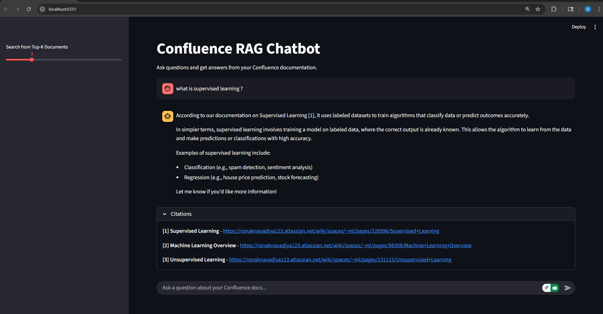

Clone Repo

Open it in VS code or any IDE

Create virtual environment ==> python -m venv myenv

Activate virtual environment ==> myenv\scripts\Activate

Install packages from requirement.txt ==>  pip install -r .\requirements.txt

setup .env file -> env_test.txt

1. Run Locally (Dev Mode)

    a. Rebuild index (fetch Confluence pages, embed, push to Azure):
        python main.py --rebuild-index

    b. Start API server (FastAPI on http://localhost:8000):
        python main.py --serve

       ( optional -  open the built-in Swagger UI to test backend:
            http://localhost:8000/docs )

    c. Start Streamlit UI
        streamlit run frontend/streamlit-ui.py

