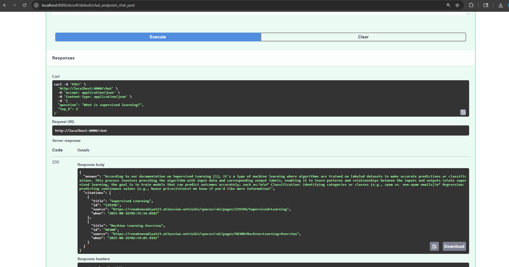

Clone Repo

Open it in VS code or any IDE

Create virtual environment ==> python -m venv myenv

Activate virtual environment ==> myenv\scripts\Activate

Install packages from requirement.txt ==>  pip install -r .\requirements.txt

Configure .env (put your values):
CONFLUENCE_URL=https://your-domain.atlassian.net/wiki
CONFLUENCE_EMAIL=you@company.com
CONFLUENCE_API_TOKEN=xxxxxx
CONFLUENCE_SPACE_KEY=ENG
INDEX_DIR=./data/index
EMBEDDING_MODEL=sentence-transformers/all-MiniLM-L6-v2
OLLAMA_MODEL=llama3.1
TOP_K=5
PORT=8000

1. Run Locally (Dev Mode)

    a. Rebuild index (fetch Confluence pages, embed, push to Azure):
        python main.py --rebuild-index

    b. Start API server (FastAPI on http://localhost:8000):
        python main.py --serve

    c. open the built-in Swagger UI:
        http://localhost:8000/docs

 